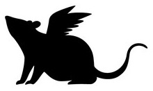

# AirMouse
A touchless input device built on the top of the physical mouse idiom using the Leap Motion Controller.
AirMouse is the result of my work for the Human Computer Interaction course (University of Florence - Prof. A. D. Bagdanov)

*In this project I studied how to emulate the behavior of a physical mouse using the 3D hand model generated by the Leap Motion device. I used machine learning techniques for recognizing the ”mouse grab” pose and a small set of mouse gestures. 
The main idea is to simulate the mouse behavior without touching any physical object but using the same idiom learned using a computer. 
AirMouse was evaluated with a usability test to assess user opinions and by a set of timed tests to collect an objective measure of the performance and an estimation of the learning curve.*

Link to the [Final Report](UsabilityTest/AirMouse - Project Report - Giovanni Cuffaro.pdf)
Link to the [Demo Video](https://vimeo.com/183378886)

## Prerequisities

* A [Leap Motion Controller](https://www.leapmotion.com/) - all the project is based on this device
* [GRT Library](https://github.com/nickgillian/grt) - Gesture Recognition Toolkit 
* [Leap Motion SDK](https://developer.leapmotion.com/) - Connect to the Leap device and access its data
* X11 lib - To manage mouse events
* ncurses - Simple text-based terminal interface

## Project structure
* **bin**: contains binaries and [instruction](bin/README.md)
* **UsabilityTest**: contains the little website user for the time test and the usability questionnaire
* **ClickGestureTrainer**: sources of the training set recorder for the click gesture (left and right)
* **Controller**: sources of the main application (AirMouse)
* **MergeTrainingSet** sources of the training sets merger
* **StaticGesturesTrainer**: sources of the training set recorder for the hand poses

## Authors

**Giovanni Cuffaro**

## License

This project is licensed under the MIT License - see the [LICENSE](LICENSE) file for details

